# Toll Collection System - UML Diagrams & Documentation

## Table of Contents
1. [Sequence Diagrams](#sequence-diagrams)
2. [Activity Diagrams](#activity-diagrams)
3. [Entity Relationship Diagram (ERD)](#entity-relationship-diagram)
4. [Data Dictionary](#data-dictionary)

---

## Sequence Diagrams

### 1. Driver Registration & Onboarding

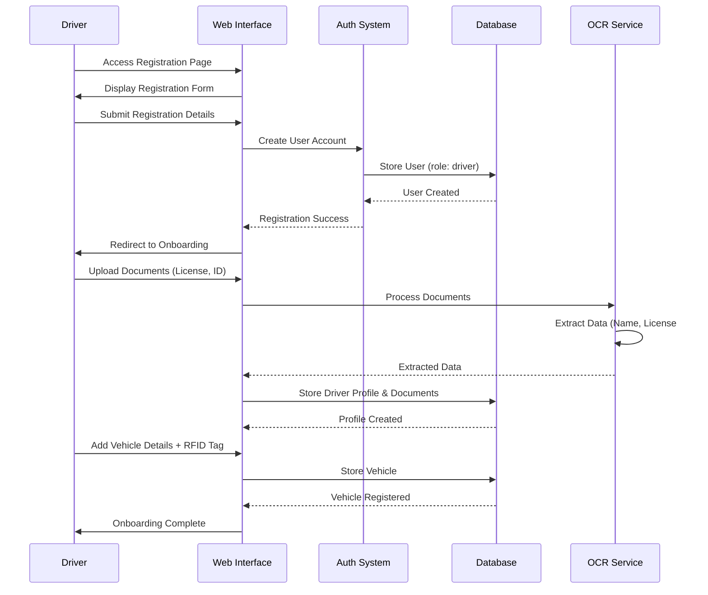

### 2. RFID Scan & Automatic Toll Collection

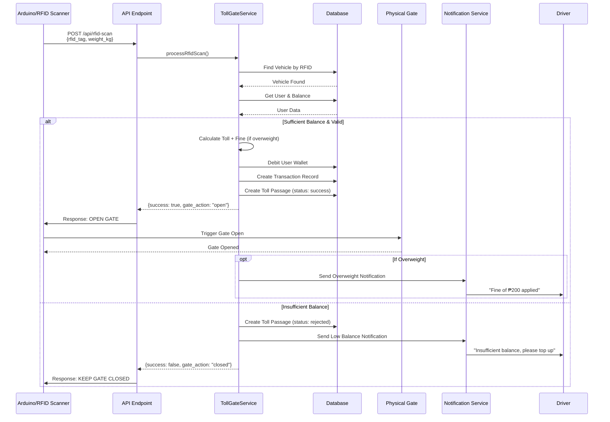

### 3. Staff Cash Payment Processing

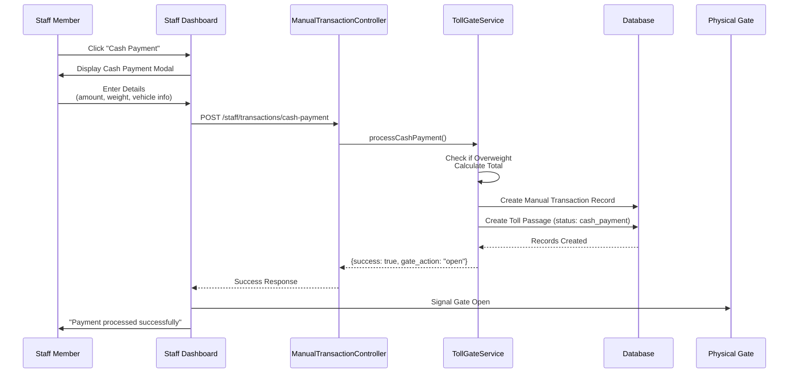

### 4. Staff Manual Override

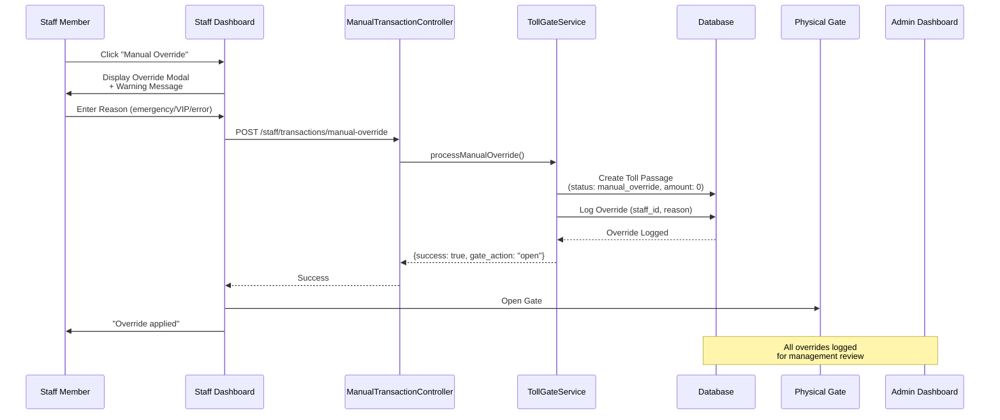

### 5. Staff Shift Management (Clock In/Out)

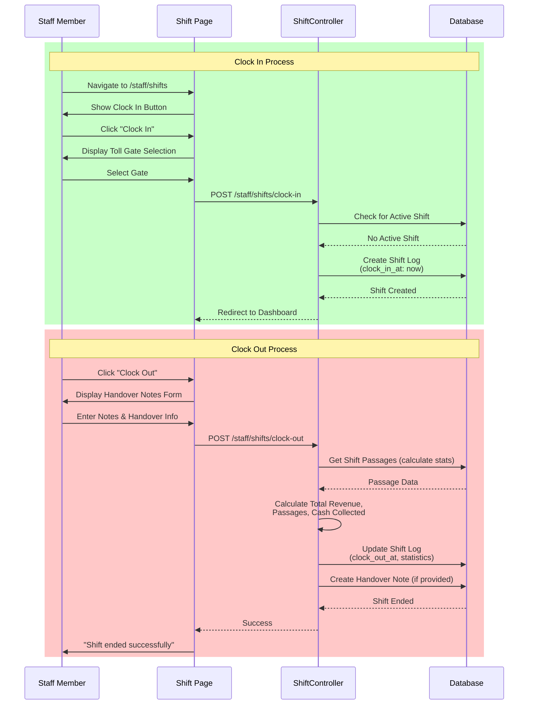

### 6. Driver Wallet Top-Up (Stripe)

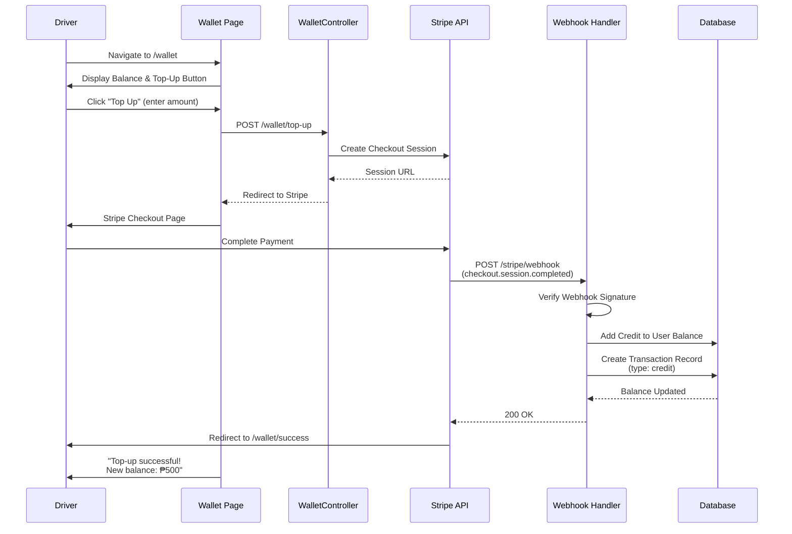

### 7. Incident Reporting by Staff

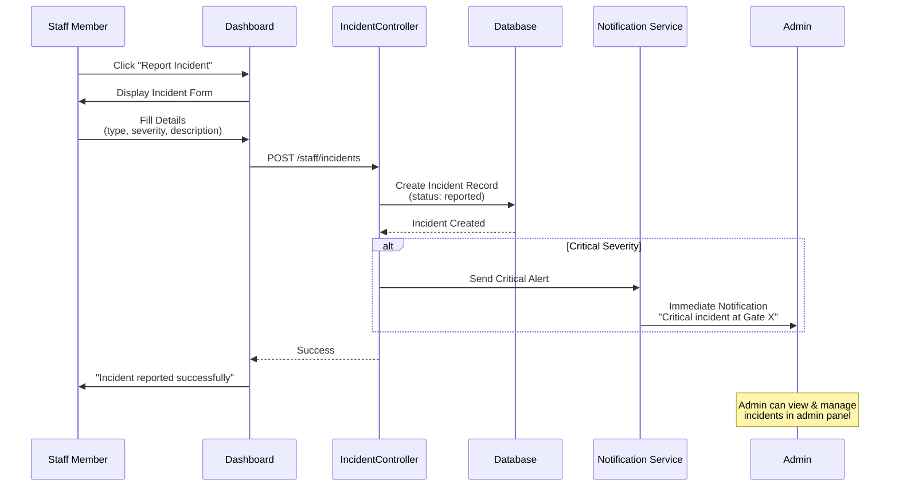

### 8. Driver Lookup by Staff

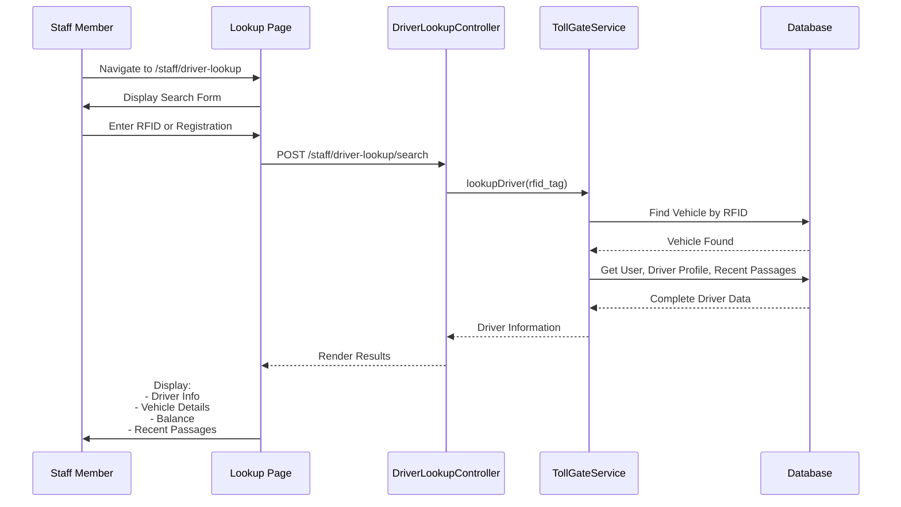

### 9. Admin Revenue Reports

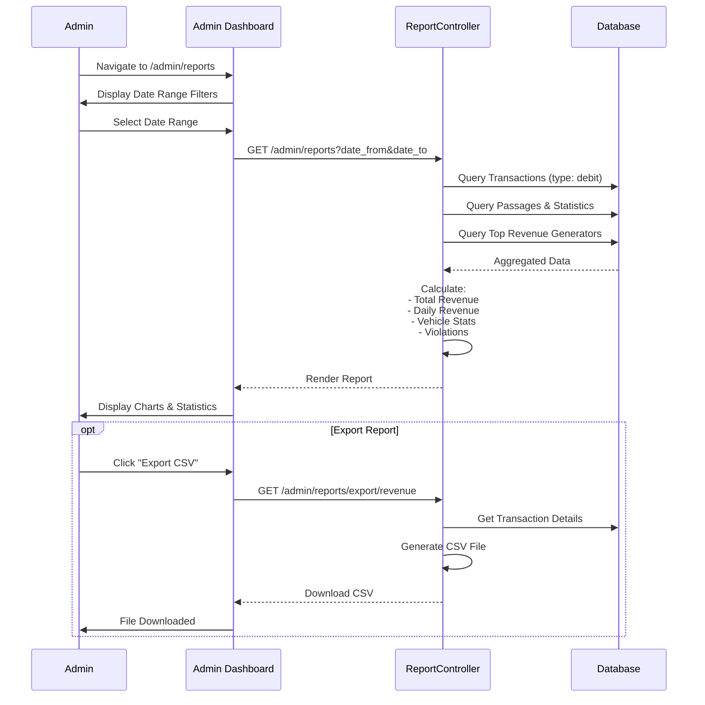

### 10. Document Verification (OCR)

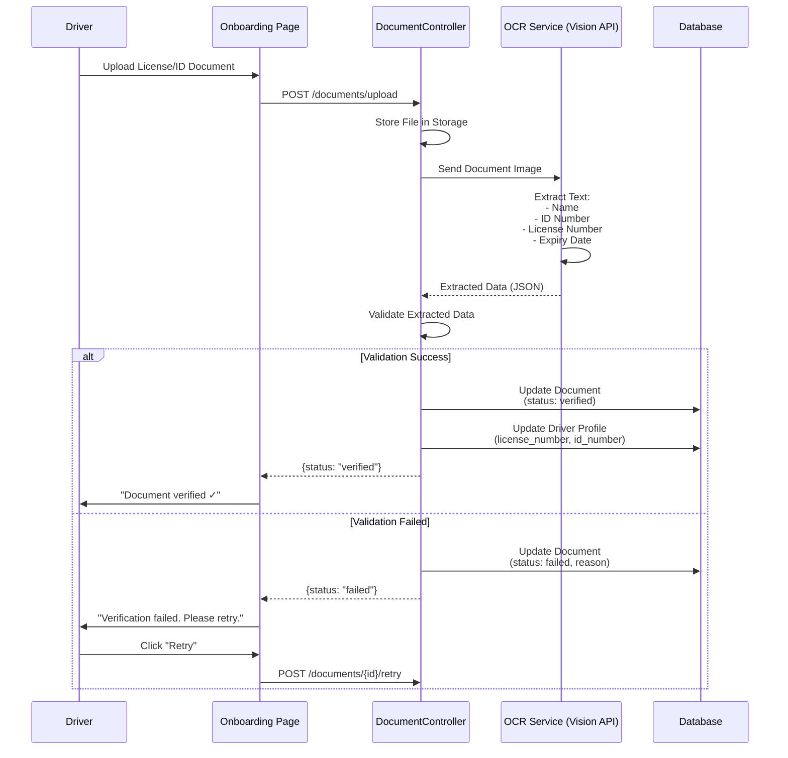

---

## Activity Diagrams

### 1. RFID Scan & Toll Collection Process

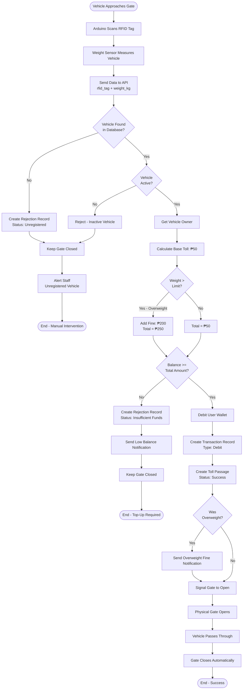

### 2. Staff Cash Payment Process

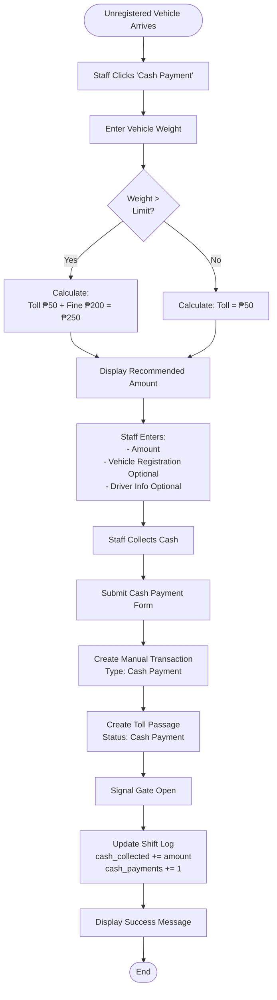

### 3. Staff Manual Override Process

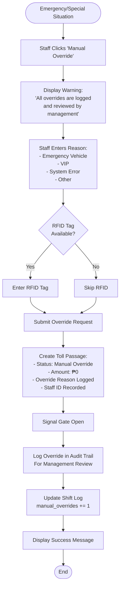

### 4. Staff Shift Management (Clock In/Out)

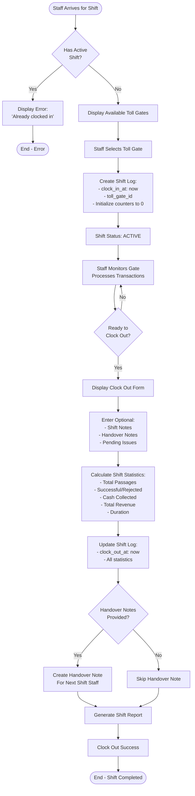

### 5. Driver Registration & Onboarding

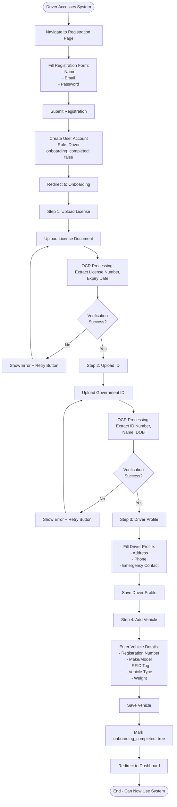

### 6. Incident Reporting & Management

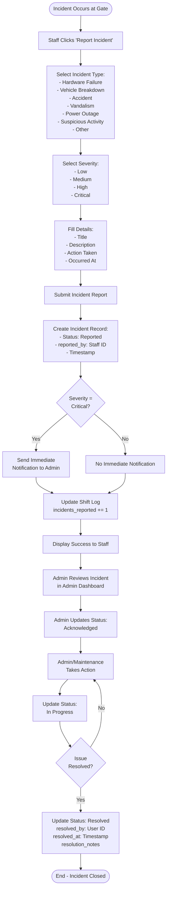

### 7. Driver Lookup by Staff

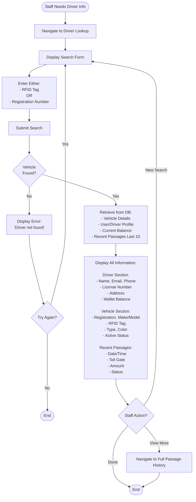

### 8. Wallet Top-Up (Stripe Payment)

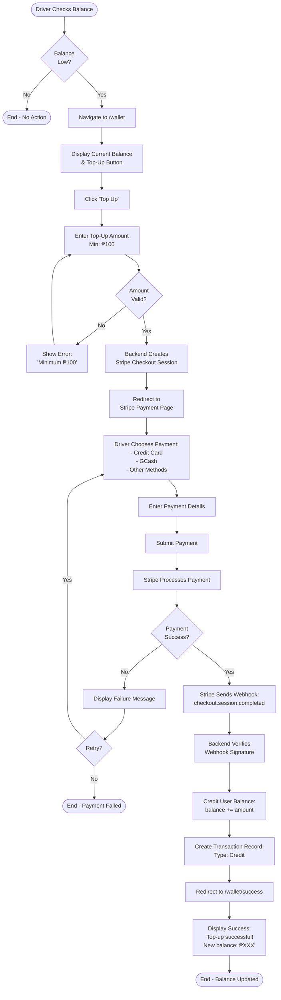

---

## Entity Relationship Diagram (ERD)

```mermaid
erDiagram
    users ||--o{ vehicles : "owns"
    users ||--o{ transactions : "has"
    users ||--o{ toll_passages : "driver"
    users ||--o{ shift_logs : "staff member"
    users ||--o{ manual_transactions : "processed by"
    users ||--o{ incidents : "reported by"
    users ||--o{ incidents : "resolved by"
    users ||--o{ handover_notes : "sends"
    users ||--o{ handover_notes : "receives"
    users ||--o{ notification_recipients : "receives"
    users ||--|| driver_profiles : "has"
    users ||--o{ driver_documents : "has"

    vehicles ||--o{ toll_passages : "passes through"

    toll_gates ||--o{ toll_passages : "records"
    toll_gates ||--o{ shift_logs : "operates"
    toll_gates ||--o{ manual_transactions : "occurs at"
    toll_gates ||--o{ incidents : "occurs at"
    toll_gates ||--o{ handover_notes : "belongs to"

    shift_logs ||--o| handover_notes : "has"

    notifications ||--o{ notification_recipients : "sent to"

    users {
        bigint id PK
        string name
        string email UK
        string password
        datetime email_verified_at
        string remember_token
        string role "driver/staff/admin"
        boolean onboarding_completed
        decimal balance
        datetime created_at
        datetime updated_at
    }

    driver_profiles {
        bigint id PK
        bigint user_id FK
        string license_number UK
        date license_expiry_date
        string phone_number
        text address
        string city
        string district
        date date_of_birth
        string id_number UK
        string emergency_contact_name
        string emergency_contact_phone
        datetime created_at
        datetime updated_at
    }

    driver_documents {
        bigint id PK
        bigint user_id FK
        string document_type "license/id"
        string file_path
        string file_type
        string verification_status "pending/verified/failed"
        text extracted_data
        text failure_reason
        datetime verified_at
        datetime created_at
        datetime updated_at
    }

    vehicles {
        bigint id PK
        bigint user_id FK
        string registration_number UK
        string make
        string model
        integer year
        string vehicle_type "car/truck/bus/motorcycle"
        string color
        decimal weight
        string rfid_tag UK
        boolean is_active
        datetime created_at
        datetime updated_at
    }

    toll_gates {
        bigint id PK
        string name
        string location
        string gate_identifier UK
        decimal base_toll_rate
        decimal overweight_fine_rate
        decimal weight_limit_kg
        boolean is_active
        string gate_status "open/closed/malfunction"
        string rfid_scanner_status "operational/offline/error"
        string weight_sensor_status "operational/offline/error"
        datetime last_heartbeat
        json hardware_info
        datetime created_at
        datetime updated_at
    }

    toll_passages {
        bigint id PK
        bigint toll_gate_id FK
        bigint user_id FK "nullable"
        bigint vehicle_id FK "nullable"
        bigint staff_id FK "nullable"
        string rfid_tag
        string status "success/rejected_insufficient_funds/rejected_unregistered/manual_override/cash_payment"
        decimal toll_amount
        decimal fine_amount
        decimal total_amount
        decimal vehicle_weight_kg
        boolean is_overweight
        string payment_method "wallet/cash/manual_override"
        text rejection_reason
        text override_reason
        json metadata
        datetime scanned_at
        datetime created_at
        datetime updated_at
    }

    shift_logs {
        bigint id PK
        bigint staff_id FK
        bigint toll_gate_id FK
        datetime clock_in_at
        datetime clock_out_at "nullable"
        integer total_passages
        integer successful_passages
        integer rejected_passages
        integer manual_overrides
        integer cash_payments
        integer incidents_reported
        decimal total_revenue
        decimal cash_collected
        text notes
        datetime created_at
        datetime updated_at
    }

    manual_transactions {
        bigint id PK
        bigint toll_gate_id FK
        bigint staff_id FK
        bigint user_id FK "nullable"
        string transaction_type "cash_payment/manual_override/fine_adjustment/balance_correction"
        decimal amount
        string vehicle_registration
        string driver_name
        string driver_contact
        text reason
        text notes
        json metadata
        datetime created_at
        datetime updated_at
    }

    incidents {
        bigint id PK
        bigint toll_gate_id FK
        bigint reported_by FK "users"
        string incident_type "hardware_failure/vehicle_breakdown/accident/vandalism/power_outage/suspicious_activity/other"
        string severity "low/medium/high/critical"
        string status "reported/acknowledged/in_progress/resolved"
        string title
        text description
        text action_taken
        text resolution_notes
        bigint resolved_by FK "users, nullable"
        datetime occurred_at
        datetime resolved_at "nullable"
        json metadata
        datetime created_at
        datetime updated_at
    }

    handover_notes {
        bigint id PK
        bigint toll_gate_id FK
        bigint from_staff_id FK "users"
        bigint to_staff_id FK "users, nullable"
        bigint shift_log_id FK "nullable"
        text notes
        json pending_issues
        boolean is_read
        datetime read_at "nullable"
        datetime created_at
        datetime updated_at
    }

    transactions {
        bigint id PK
        bigint user_id FK
        string type "credit/debit"
        decimal amount
        decimal balance_after
        string description
        string reference
        json metadata
        datetime created_at
        datetime updated_at
    }

    notifications {
        bigint id PK
        string type "low_balance/overweight_fine/toll_rate/general"
        string title
        text message
        text data
        bigint created_by FK "users, nullable"
        datetime sent_at
        datetime created_at
        datetime updated_at
    }

    notification_recipients {
        bigint id PK
        bigint notification_id FK
        bigint user_id FK
        boolean is_read
        datetime read_at "nullable"
        datetime created_at
        datetime updated_at
    }
```

---

## Data Dictionary

### Table: `users`
**Description:** Core user accounts for drivers, staff, and administrators.

| Column Name | Data Type | Constraints | Description |
|------------|-----------|-------------|-------------|
| id | BIGINT | PRIMARY KEY, AUTO_INCREMENT | Unique user identifier |
| name | VARCHAR(255) | NOT NULL | Full name of the user |
| email | VARCHAR(255) | UNIQUE, NOT NULL | Email address for login |
| email_verified_at | TIMESTAMP | NULL | Email verification timestamp |
| password | VARCHAR(255) | NOT NULL | Hashed password |
| remember_token | VARCHAR(100) | NULL | Remember me token |
| role | VARCHAR(50) | NOT NULL, DEFAULT 'driver' | User role: driver, staff, or admin |
| onboarding_completed | BOOLEAN | DEFAULT FALSE | Whether driver has completed onboarding |
| balance | DECIMAL(10,2) | DEFAULT 0.00 | Current wallet balance |
| created_at | TIMESTAMP | NULL | Record creation timestamp |
| updated_at | TIMESTAMP | NULL | Last update timestamp |

**Indexes:**
- PRIMARY KEY (id)
- UNIQUE INDEX (email)
- INDEX (role)

---

### Table: `driver_profiles`
**Description:** Extended profile information for drivers.

| Column Name | Data Type | Constraints | Description |
|------------|-----------|-------------|-------------|
| id | BIGINT | PRIMARY KEY, AUTO_INCREMENT | Unique profile identifier |
| user_id | BIGINT | FOREIGN KEY (users.id), UNIQUE, ON DELETE CASCADE | Reference to user account |
| license_number | VARCHAR(255) | UNIQUE, NOT NULL | Driver's license number |
| license_expiry_date | DATE | NOT NULL | License expiration date |
| phone_number | VARCHAR(255) | NOT NULL | Contact phone number |
| address | TEXT | NOT NULL | Full street address |
| city | VARCHAR(255) | NOT NULL | City name |
| district | VARCHAR(255) | NULL | District/region |
| date_of_birth | DATE | NOT NULL | Driver's date of birth |
| id_number | VARCHAR(255) | UNIQUE, NOT NULL | Government ID number |
| emergency_contact_name | VARCHAR(255) | NOT NULL | Emergency contact person |
| emergency_contact_phone | VARCHAR(255) | NOT NULL | Emergency contact phone |
| created_at | TIMESTAMP | NULL | Record creation timestamp |
| updated_at | TIMESTAMP | NULL | Last update timestamp |

**Indexes:**
- PRIMARY KEY (id)
- UNIQUE INDEX (license_number)
- UNIQUE INDEX (id_number)
- FOREIGN KEY (user_id)

---

### Table: `driver_documents`
**Description:** Uploaded documents for driver verification (license, ID).

| Column Name | Data Type | Constraints | Description |
|------------|-----------|-------------|-------------|
| id | BIGINT | PRIMARY KEY, AUTO_INCREMENT | Unique document identifier |
| user_id | BIGINT | FOREIGN KEY (users.id), ON DELETE CASCADE | Reference to user |
| document_type | VARCHAR(50) | NOT NULL | Type: 'license' or 'id' |
| file_path | VARCHAR(500) | NOT NULL | Storage path to document file |
| file_type | VARCHAR(50) | NOT NULL | MIME type (image/jpeg, etc) |
| verification_status | VARCHAR(50) | NOT NULL, DEFAULT 'pending' | Status: pending, verified, failed |
| extracted_data | TEXT | NULL | JSON data extracted by OCR |
| failure_reason | TEXT | NULL | Reason if verification failed |
| verified_at | TIMESTAMP | NULL | Verification completion timestamp |
| created_at | TIMESTAMP | NULL | Record creation timestamp |
| updated_at | TIMESTAMP | NULL | Last update timestamp |

**Indexes:**
- PRIMARY KEY (id)
- FOREIGN KEY (user_id)
- INDEX (verification_status)

---

### Table: `vehicles`
**Description:** Registered vehicles with RFID tags.

| Column Name | Data Type | Constraints | Description |
|------------|-----------|-------------|-------------|
| id | BIGINT | PRIMARY KEY, AUTO_INCREMENT | Unique vehicle identifier |
| user_id | BIGINT | FOREIGN KEY (users.id), ON DELETE CASCADE | Vehicle owner |
| registration_number | VARCHAR(255) | UNIQUE, NOT NULL | License plate number |
| make | VARCHAR(255) | NOT NULL | Vehicle manufacturer |
| model | VARCHAR(255) | NOT NULL | Vehicle model |
| year | INTEGER | NOT NULL | Manufacturing year |
| vehicle_type | VARCHAR(50) | NOT NULL | Type: car, truck, bus, motorcycle |
| color | VARCHAR(100) | NOT NULL | Vehicle color |
| weight | DECIMAL(10,2) | NOT NULL | Registered vehicle weight (kg) |
| rfid_tag | VARCHAR(255) | UNIQUE, NOT NULL | RFID tag identifier |
| is_active | BOOLEAN | DEFAULT TRUE | Whether vehicle is active |
| created_at | TIMESTAMP | NULL | Record creation timestamp |
| updated_at | TIMESTAMP | NULL | Last update timestamp |

**Indexes:**
- PRIMARY KEY (id)
- UNIQUE INDEX (registration_number)
- UNIQUE INDEX (rfid_tag)
- FOREIGN KEY (user_id)

---

### Table: `toll_gates`
**Description:** Physical toll gates with hardware status.

| Column Name | Data Type | Constraints | Description |
|------------|-----------|-------------|-------------|
| id | BIGINT | PRIMARY KEY, AUTO_INCREMENT | Unique gate identifier |
| name | VARCHAR(255) | NOT NULL | Gate name/identifier |
| location | VARCHAR(500) | NOT NULL | Physical location description |
| gate_identifier | VARCHAR(100) | UNIQUE, NOT NULL | Unique gate code |
| base_toll_rate | DECIMAL(10,2) | NOT NULL, DEFAULT 50.00 | Standard toll fee |
| overweight_fine_rate | DECIMAL(10,2) | NOT NULL, DEFAULT 200.00 | Fine for overweight vehicles |
| weight_limit_kg | DECIMAL(10,2) | NOT NULL, DEFAULT 5000.00 | Maximum weight limit |
| is_active | BOOLEAN | DEFAULT TRUE | Whether gate is operational |
| gate_status | VARCHAR(50) | DEFAULT 'closed' | Current status: open, closed, malfunction |
| rfid_scanner_status | VARCHAR(50) | DEFAULT 'operational' | Scanner status: operational, offline, error |
| weight_sensor_status | VARCHAR(50) | DEFAULT 'operational' | Sensor status: operational, offline, error |
| last_heartbeat | TIMESTAMP | NULL | Last hardware check-in |
| hardware_info | JSON | NULL | Hardware configuration details |
| created_at | TIMESTAMP | NULL | Record creation timestamp |
| updated_at | TIMESTAMP | NULL | Last update timestamp |

**Indexes:**
- PRIMARY KEY (id)
- UNIQUE INDEX (gate_identifier)

---

### Table: `toll_passages`
**Description:** Record of every vehicle passage (successful or rejected).

| Column Name | Data Type | Constraints | Description |
|------------|-----------|-------------|-------------|
| id | BIGINT | PRIMARY KEY, AUTO_INCREMENT | Unique passage identifier |
| toll_gate_id | BIGINT | FOREIGN KEY (toll_gates.id), ON DELETE CASCADE | Gate where passage occurred |
| user_id | BIGINT | FOREIGN KEY (users.id), ON DELETE SET NULL, NULL | Driver (if registered) |
| vehicle_id | BIGINT | FOREIGN KEY (vehicles.id), ON DELETE SET NULL, NULL | Vehicle (if registered) |
| staff_id | BIGINT | FOREIGN KEY (users.id), ON DELETE SET NULL, NULL | Staff who processed (if manual) |
| rfid_tag | VARCHAR(255) | NULL | RFID tag scanned |
| status | VARCHAR(50) | NOT NULL | success, rejected_insufficient_funds, rejected_unregistered, manual_override, cash_payment |
| toll_amount | DECIMAL(10,2) | DEFAULT 0.00 | Base toll charged |
| fine_amount | DECIMAL(10,2) | DEFAULT 0.00 | Fine amount (if overweight) |
| total_amount | DECIMAL(10,2) | DEFAULT 0.00 | Total charged |
| vehicle_weight_kg | DECIMAL(10,2) | NULL | Measured vehicle weight |
| is_overweight | BOOLEAN | DEFAULT FALSE | Whether vehicle exceeded weight limit |
| payment_method | VARCHAR(50) | DEFAULT 'wallet' | wallet, cash, manual_override |
| rejection_reason | TEXT | NULL | Reason if rejected |
| override_reason | TEXT | NULL | Reason if manually overridden |
| metadata | JSON | NULL | Additional data |
| scanned_at | TIMESTAMP | NOT NULL | When RFID was scanned |
| created_at | TIMESTAMP | NULL | Record creation timestamp |
| updated_at | TIMESTAMP | NULL | Last update timestamp |

**Indexes:**
- PRIMARY KEY (id)
- FOREIGN KEY (toll_gate_id, user_id, vehicle_id, staff_id)
- INDEX (toll_gate_id, created_at)
- INDEX (user_id, created_at)
- INDEX (status)

---

### Table: `shift_logs`
**Description:** Staff shift records with statistics.

| Column Name | Data Type | Constraints | Description |
|------------|-----------|-------------|-------------|
| id | BIGINT | PRIMARY KEY, AUTO_INCREMENT | Unique shift identifier |
| staff_id | BIGINT | FOREIGN KEY (users.id), ON DELETE CASCADE | Staff member |
| toll_gate_id | BIGINT | FOREIGN KEY (toll_gates.id), ON DELETE CASCADE | Gate assigned |
| clock_in_at | TIMESTAMP | NOT NULL | Shift start time |
| clock_out_at | TIMESTAMP | NULL | Shift end time |
| total_passages | INTEGER | DEFAULT 0 | Total vehicles processed |
| successful_passages | INTEGER | DEFAULT 0 | Successful toll collections |
| rejected_passages | INTEGER | DEFAULT 0 | Rejected vehicles |
| manual_overrides | INTEGER | DEFAULT 0 | Manual gate openings |
| cash_payments | INTEGER | DEFAULT 0 | Cash transactions processed |
| incidents_reported | INTEGER | DEFAULT 0 | Incidents reported during shift |
| total_revenue | DECIMAL(10,2) | DEFAULT 0.00 | Total revenue collected |
| cash_collected | DECIMAL(10,2) | DEFAULT 0.00 | Cash collected |
| notes | TEXT | NULL | Staff notes about shift |
| created_at | TIMESTAMP | NULL | Record creation timestamp |
| updated_at | TIMESTAMP | NULL | Last update timestamp |

**Indexes:**
- PRIMARY KEY (id)
- FOREIGN KEY (staff_id, toll_gate_id)
- INDEX (staff_id, clock_in_at)
- INDEX (toll_gate_id)

---

### Table: `manual_transactions`
**Description:** Manual transactions processed by staff (cash, overrides, fines).

| Column Name | Data Type | Constraints | Description |
|------------|-----------|-------------|-------------|
| id | BIGINT | PRIMARY KEY, AUTO_INCREMENT | Unique transaction identifier |
| toll_gate_id | BIGINT | FOREIGN KEY (toll_gates.id), ON DELETE CASCADE | Gate where processed |
| staff_id | BIGINT | FOREIGN KEY (users.id), ON DELETE CASCADE | Staff who processed |
| user_id | BIGINT | FOREIGN KEY (users.id), ON DELETE SET NULL, NULL | Driver (if applicable) |
| transaction_type | VARCHAR(50) | NOT NULL | cash_payment, manual_override, fine_adjustment, balance_correction |
| amount | DECIMAL(10,2) | NOT NULL | Transaction amount |
| vehicle_registration | VARCHAR(255) | NULL | Vehicle plate (if unregistered) |
| driver_name | VARCHAR(255) | NULL | Driver name (if unregistered) |
| driver_contact | VARCHAR(255) | NULL | Driver contact (if provided) |
| reason | TEXT | NOT NULL | Reason for manual transaction |
| notes | TEXT | NULL | Additional notes |
| metadata | JSON | NULL | Additional data |
| created_at | TIMESTAMP | NULL | Record creation timestamp |
| updated_at | TIMESTAMP | NULL | Last update timestamp |

**Indexes:**
- PRIMARY KEY (id)
- FOREIGN KEY (toll_gate_id, staff_id, user_id)
- INDEX (toll_gate_id, created_at)
- INDEX (staff_id)
- INDEX (transaction_type)

---

### Table: `incidents`
**Description:** Incidents reported at toll gates (hardware failures, accidents, etc).

| Column Name | Data Type | Constraints | Description |
|------------|-----------|-------------|-------------|
| id | BIGINT | PRIMARY KEY, AUTO_INCREMENT | Unique incident identifier |
| toll_gate_id | BIGINT | FOREIGN KEY (toll_gates.id), ON DELETE CASCADE | Gate where incident occurred |
| reported_by | BIGINT | FOREIGN KEY (users.id), ON DELETE CASCADE | Staff who reported |
| incident_type | VARCHAR(50) | NOT NULL | hardware_failure, vehicle_breakdown, accident, vandalism, power_outage, suspicious_activity, other |
| severity | VARCHAR(50) | NOT NULL | low, medium, high, critical |
| status | VARCHAR(50) | DEFAULT 'reported' | reported, acknowledged, in_progress, resolved |
| title | VARCHAR(255) | NOT NULL | Brief incident summary |
| description | TEXT | NOT NULL | Detailed description |
| action_taken | TEXT | NULL | Actions taken by staff |
| resolution_notes | TEXT | NULL | Resolution details |
| resolved_by | BIGINT | FOREIGN KEY (users.id), ON DELETE SET NULL, NULL | Who resolved the incident |
| occurred_at | TIMESTAMP | NOT NULL | When incident occurred |
| resolved_at | TIMESTAMP | NULL | When incident was resolved |
| metadata | JSON | NULL | Additional data |
| created_at | TIMESTAMP | NULL | Record creation timestamp |
| updated_at | TIMESTAMP | NULL | Last update timestamp |

**Indexes:**
- PRIMARY KEY (id)
- FOREIGN KEY (toll_gate_id, reported_by, resolved_by)
- INDEX (toll_gate_id, created_at)
- INDEX (incident_type)
- INDEX (status)
- INDEX (severity)

---

### Table: `handover_notes`
**Description:** Notes left by staff for next shift.

| Column Name | Data Type | Constraints | Description |
|------------|-----------|-------------|-------------|
| id | BIGINT | PRIMARY KEY, AUTO_INCREMENT | Unique note identifier |
| toll_gate_id | BIGINT | FOREIGN KEY (toll_gates.id), ON DELETE CASCADE | Gate related to note |
| from_staff_id | BIGINT | FOREIGN KEY (users.id), ON DELETE CASCADE | Staff leaving the note |
| to_staff_id | BIGINT | FOREIGN KEY (users.id), ON DELETE SET NULL, NULL | Specific staff recipient |
| shift_log_id | BIGINT | FOREIGN KEY (shift_logs.id), ON DELETE SET NULL, NULL | Related shift |
| notes | TEXT | NOT NULL | Handover notes content |
| pending_issues | JSON | NULL | List of pending issues |
| is_read | BOOLEAN | DEFAULT FALSE | Whether note has been read |
| read_at | TIMESTAMP | NULL | When note was read |
| created_at | TIMESTAMP | NULL | Record creation timestamp |
| updated_at | TIMESTAMP | NULL | Last update timestamp |

**Indexes:**
- PRIMARY KEY (id)
- FOREIGN KEY (toll_gate_id, from_staff_id, to_staff_id, shift_log_id)
- INDEX (toll_gate_id, created_at)
- INDEX (from_staff_id)
- INDEX (to_staff_id)

---

### Table: `transactions`
**Description:** Financial transactions for user wallets (credits/debits).

| Column Name | Data Type | Constraints | Description |
|------------|-----------|-------------|-------------|
| id | BIGINT | PRIMARY KEY, AUTO_INCREMENT | Unique transaction identifier |
| user_id | BIGINT | FOREIGN KEY (users.id), ON DELETE CASCADE | User account |
| type | VARCHAR(50) | NOT NULL | credit (top-up), debit (toll payment) |
| amount | DECIMAL(10,2) | NOT NULL | Transaction amount |
| balance_after | DECIMAL(10,2) | NOT NULL | Balance after transaction |
| description | VARCHAR(500) | NOT NULL | Transaction description |
| reference | VARCHAR(255) | NULL | Reference number (e.g., TOLL-123456) |
| metadata | JSON | NULL | Additional transaction data |
| created_at | TIMESTAMP | NULL | Record creation timestamp |
| updated_at | TIMESTAMP | NULL | Last update timestamp |

**Indexes:**
- PRIMARY KEY (id)
- FOREIGN KEY (user_id)
- INDEX (user_id, created_at)
- INDEX (type)

---

### Table: `notifications`
**Description:** System notifications sent to users.

| Column Name | Data Type | Constraints | Description |
|------------|-----------|-------------|-------------|
| id | BIGINT | PRIMARY KEY, AUTO_INCREMENT | Unique notification identifier |
| type | VARCHAR(50) | NOT NULL | low_balance, overweight_fine, toll_rate, general |
| title | VARCHAR(255) | NOT NULL | Notification title |
| message | TEXT | NOT NULL | Notification content |
| data | TEXT | NULL | JSON data for notification |
| created_by | BIGINT | FOREIGN KEY (users.id), ON DELETE SET NULL, NULL | Creator (if admin-sent) |
| sent_at | TIMESTAMP | NOT NULL | When notification was sent |
| created_at | TIMESTAMP | NULL | Record creation timestamp |
| updated_at | TIMESTAMP | NULL | Last update timestamp |

**Indexes:**
- PRIMARY KEY (id)
- FOREIGN KEY (created_by)

---

### Table: `notification_recipients`
**Description:** Tracks which users received which notifications.

| Column Name | Data Type | Constraints | Description |
|------------|-----------|-------------|-------------|
| id | BIGINT | PRIMARY KEY, AUTO_INCREMENT | Unique recipient record |
| notification_id | BIGINT | FOREIGN KEY (notifications.id), ON DELETE CASCADE | Notification reference |
| user_id | BIGINT | FOREIGN KEY (users.id), ON DELETE CASCADE | Recipient user |
| is_read | BOOLEAN | DEFAULT FALSE | Whether user has read it |
| read_at | TIMESTAMP | NULL | When user read it |
| created_at | TIMESTAMP | NULL | Record creation timestamp |
| updated_at | TIMESTAMP | NULL | Last update timestamp |

**Indexes:**
- PRIMARY KEY (id)
- FOREIGN KEY (notification_id, user_id)
- UNIQUE INDEX (notification_id, user_id)

---

## Summary

This documentation provides:

1. **10 Sequence Diagrams** showing interactions between components for all major features
2. **8 Activity Diagrams** showing workflow processes for key operations
3. **Complete ERD** with all 13 database tables and their relationships
4. **Detailed Data Dictionary** for all 13 tables with 150+ fields

All diagrams use **Mermaid syntax** and can be rendered in:
- GitHub markdown
- GitLab markdown
- VS Code (with Mermaid extension)
- Notion
- Any Mermaid-compatible viewer

The system covers:
- Driver features (registration, onboarding, wallet, passages)
- Staff features (shifts, cash payments, overrides, incidents, lookup)
- Admin features (reports, notifications, management)
- Hardware integration (Arduino, RFID, weight sensors)
